# キーボードで太鼓の達人ドンダフルフェスティバルを快適にプレイする方法

このページは下書きです。
正式版は [キーボードで「太鼓の達人ドンダフルフェスティバル」を快適にプレイする方法｜UltraSound(US)](https://note.com/ultrasound_us/n/n5caa70f40775) に投稿しました。

## はじめに

こんにちは！UltraSound(US) です。

突然ですが、皆さんは Steam 版の太鼓の達人ドンダフルフェスティバル（以下ドンフェス）をプレイしていますか？

Steam 版のドンフェスは、家庭用の太鼓の達人で初めて 120 fps に対応しています。ドンフェスを初めて起動したときにスムーズに動くどんちゃんを見て、感動したことを覚えています。

しかし、ドンフェスをプレイしていて、筆者が不満に思うことがあります。それは、**キーボードのキー割当です**。
初期設定では、ドン（面）に 2 個のキー、カツ（縁）にも 2 個のキーが割り当てられています。そのせいで、高速譜面をプレイするときに不利になります。

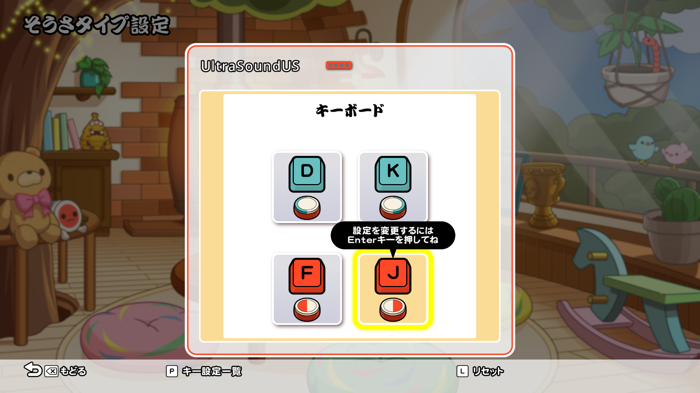

近年の高難易度譜面は、1 秒間に 20 回以上叩くことが要求されます。
そのような高速譜面に対抗する手段として、片手で 1 回叩くときに 2 回以上反応させる**ロール処理**が必須技術になりつつあります（スーパーマン以外）。

この note では、ドンフェスをキーボードでプレイする際に、**ロール処理を行うための設定方法**を紹介します。
ここで説明した設定で、秒速 20 打が要求される「Calculator」を筆者でもフルコンボできました。是非、ご覧ください（宣伝）。

<iframe width="560" height="315" src="https://www.youtube.com/embed/F6l3Ip0caBc?start=103" title="YouTube video player" frameborder="0" allow="accelerometer; autoplay; clipboard-write; encrypted-media; gyroscope; picture-in-picture; web-share" referrerpolicy="strict-origin-when-cross-origin" allowfullscreen></iframe>

## 設定方針

初期状態のキーボード割り当ては、下の図のようになっています。

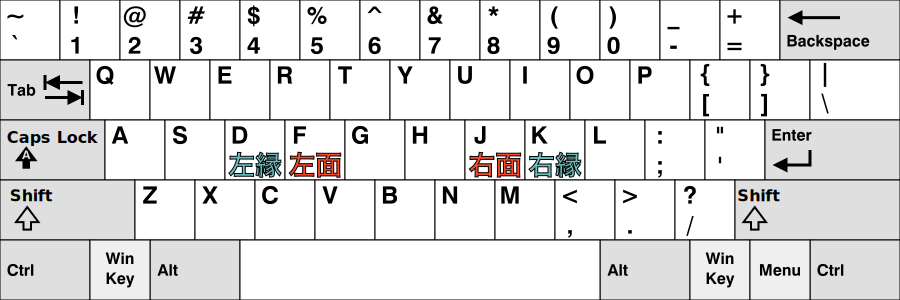

次に目指すべき理想の設定は、こうです！

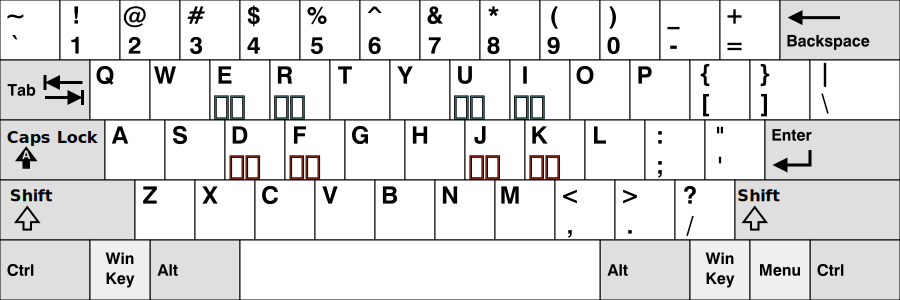

このような設定にすれば、片手で 1 回叩くときに、2 本指を使って「面面」「縁縁」「面縁」「縁面」の 4 通りで叩けます。

しかし、ドンフェスの割り当て設定では、このようなキーを合計 8 個割り当てることができません。
ではどうするか？
それは**キーボードを押したときに、コントローラーを押したとみなす**ようにすることです。

コントローラーは図のように、面に 4 ボタン、縁に 8 ボタン割り当てられています（タイプ 1）。

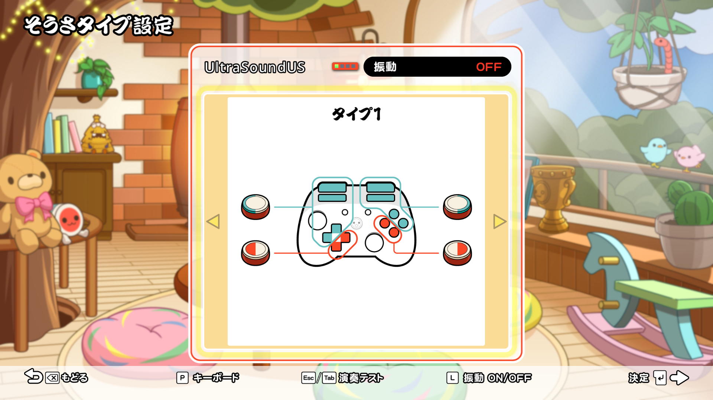

ここで、発想を転換します。
4 キーしか割り当てできないキーボードを、8 キー以上割り当てできるコントローラーとしてドンフェスに認識させるのです。

まとめると、以下のようなキーボード → コントローラーの割り当てを目指します。

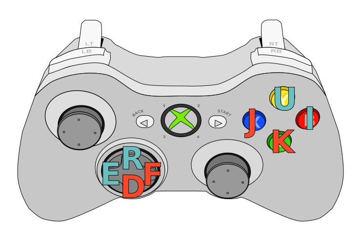

## 実現するソフトウェア

やりたいことは決定しましたが、実現するソフトウェアは多くはありませんでした。
コントローラー → キーボードに割り当てるソフトウェアは多いですが（e.g., [JoyToKey](https://joytokey.net/ja/)）、逆は少ないです。
割り当てできたとしても、無反応が起きたり、入力遅延が多かったり、満足にプレイできませんでした。

ネットの海を漂うこと数週間、数々のソフトウェアを試し、最高のソフトウェアを見つけました。
それは、「[djlastnight's Gaming Keyboard Splitter](https://github.com/djlastnight/KeyboardSplitterXbox)」です。
Gaming Keyboard Splitter は、仮想の Xbox 360 コントローラーを作り、キーボードからコントローラーを操作できます。

> Creates up to 4 virtual xbox 360 controllers and feeds them via one or more keyboards (up to 10).
>
> 「[djlastnight's Gaming Keyboard Splitter](https://github.com/djlastnight/KeyboardSplitterXbox)」より引用
>
>> 最大 4 つの仮想 Xbox 360 コントローラーを作成し、1 つ以上のキーボード（最大 10 個）を介してそれらにデータを供給します。
>>
>> 翻訳: Google 翻訳

## 設定方法

では、実際に設定していきましょう。

以下注意点です。

- Gaming Keyboard Splitter のインストールは扱いません。インストール方法は、[公式 GitHub ページ](https://github.com/djlastnight/KeyboardSplitterXbox) を参照してください。
- 2024 年 12 月 8 日現在の最新ドンフェス (Version: 1.1.1) で動作を確認しています。他のバージョンでは動作しない可能性があります。
- 本 note の内容で、不具合が発生しても責任は負いかねます。**自己責任**でお願いします。

### 1. 起動

起動後画面:

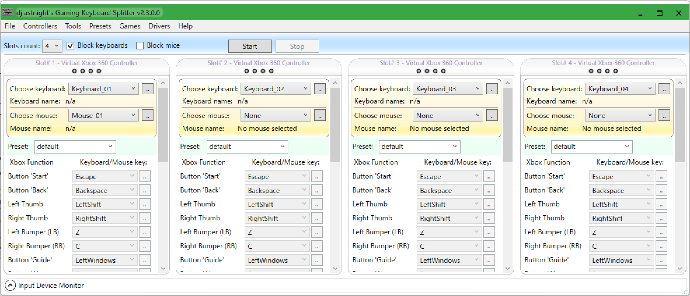

### 2. プリセット設定

一人プレイなので、Slots count を 1 にする

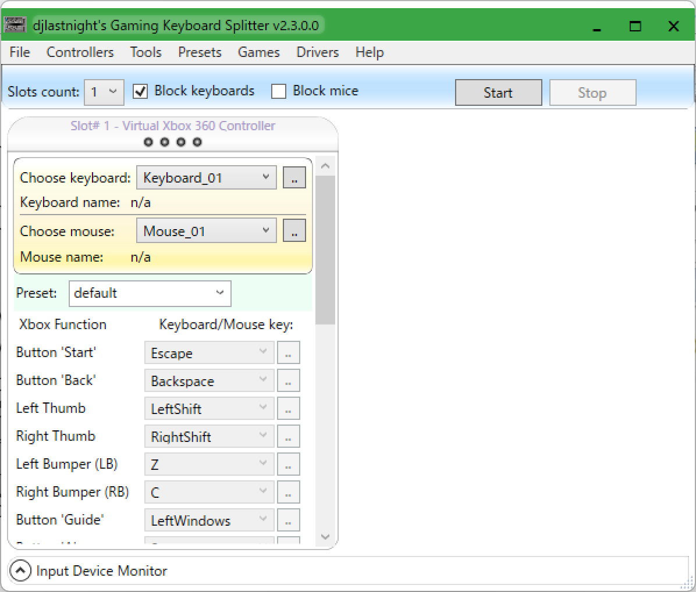

プリセット名を default と書かれている部分に書き込む
今回は `roll-shori` とした
※ もっと良い名前にしましょう

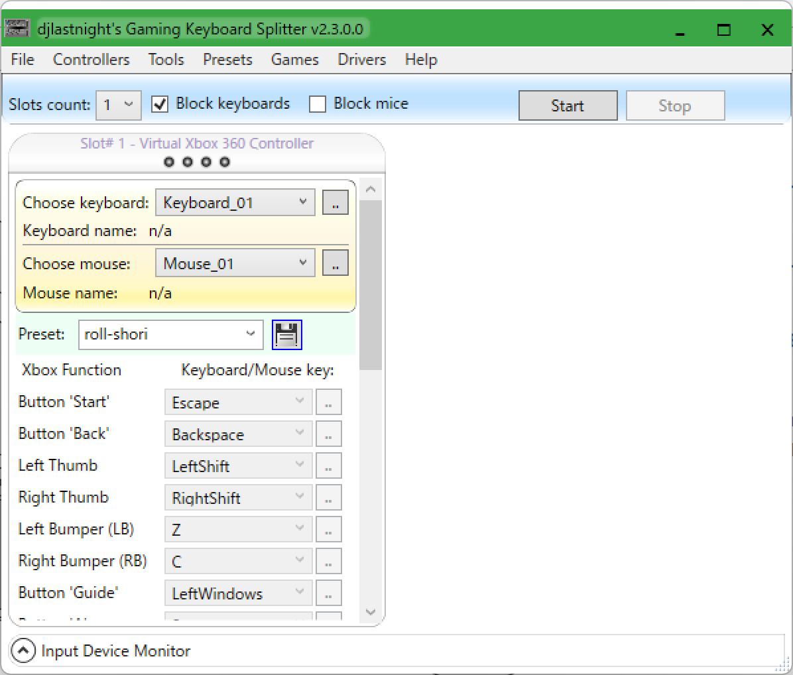

## 3. キーボード選択

Choose keyboard の右側の .. を押すと、新しいウィンドウが開くので、キーボードのいずれかのキーを押すと選択できる

## 4. キー設定

割り振りたいコントローラーのボタンを選び、右側の .. を押して、割り振りたいキーを押す

割り振った結果がこちら
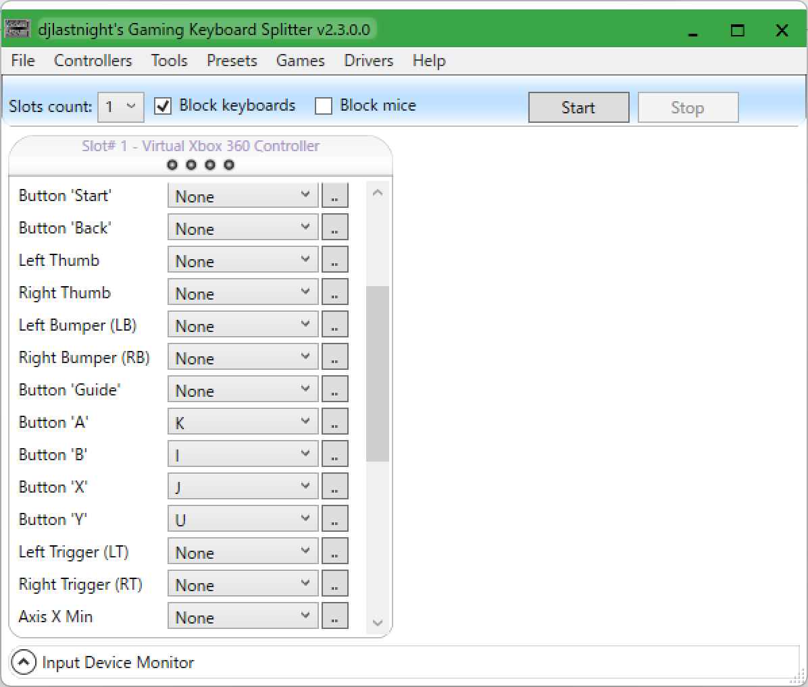
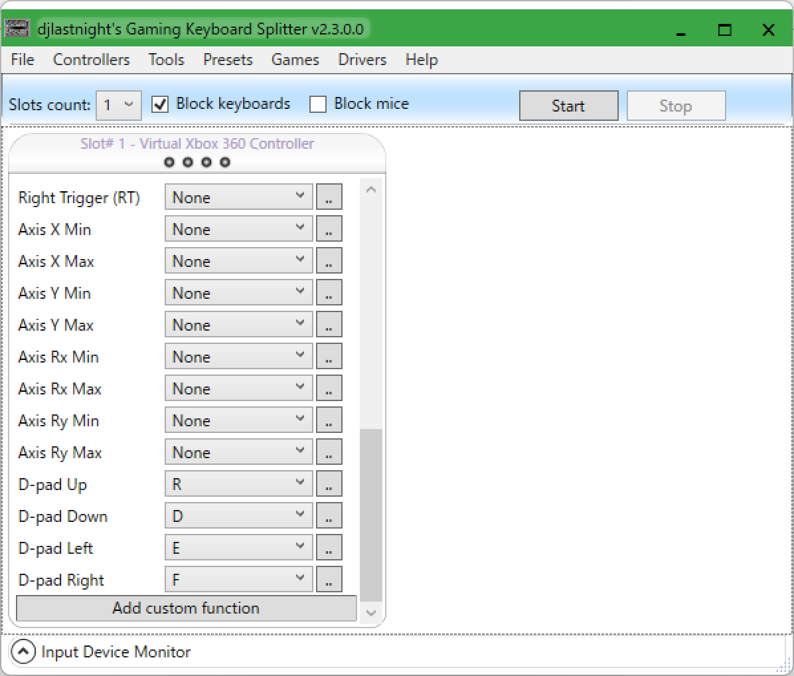

## 5. 開始！

右上の Start を押すと、設定が適用される

※ Block keyboards が OFF になっていると、キーボード入力も受け付けるので、ON にしておくとよい

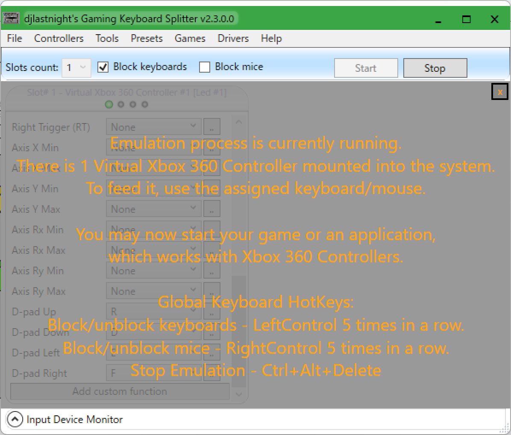

### 6. （任意）入力テスト

Controllers タブ → Test Xinput Controllers でテストができる

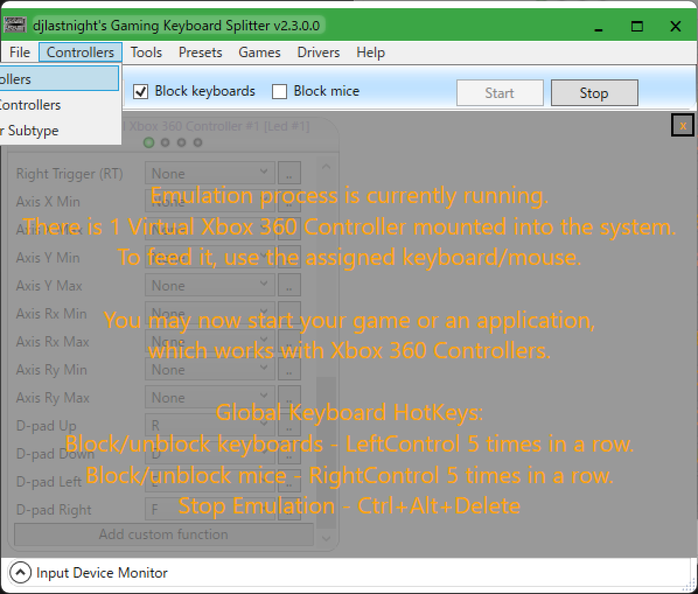
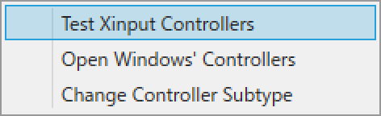

テスト画面

光っていることを確認

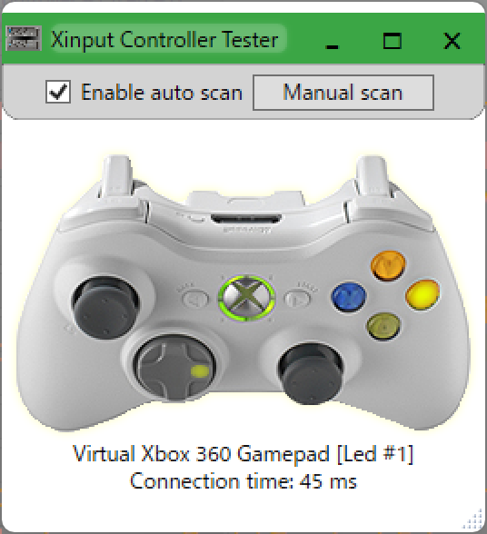

## おわりに

他に、便利な設定があれば、教えてください。

**楽しいドンフェスライフを！**

## 参考

- コントローラー画像: [Xbox Controller.svg](https://commons.wikimedia.org/wiki/File:Xbox_Controller.svg)
- キーボード画像: [KB_United_States.svg](https://commons.wikimedia.org/wiki/File:KB_United_States.svg)
- djlastnight's Gaming Keyboard Splitter: [GitHub - djlastnight/KeyboardSplitterXbox: Creates up to 4 virtual xbox 360 controllers and feeds them via one or more keyboards.](https://github.com/djlastnight/KeyboardSplitterXbox)

## 宣伝

- 筆者の YouTube チャンネル: [UltraSound(US) - YouTube](https://www.youtube.com/@ultrasound_us)
- 筆者の Twitter（現 X）: [UltraSound(US) (@UltraSound_US) / Twitter](https://twitter.com/UltraSound_US)
