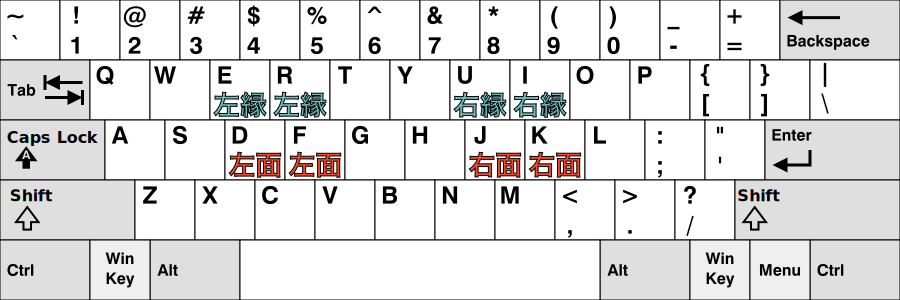

# 太鼓の達人キーボード設定（仮称）

## Steam 版ドンフェスの良いところ、悪いところ

- Steam 版のドンフェスやってる？
  - 良いところ: 120 fps に家庭用で初めて対応してる
  - 悪いところ: キーボード設定がいまいち

## キーボード設定の何がいまいち？

- 4 個のキーしか使えない
  - 2 個のキーを面、2 個のキーを縁に割り振る
- 4 個キーのデメリット
  - 連打が遅い
    - e.g. コントローラーの場合は、4 個のキーを面、6 個のキーを縁に割り振ることができる
  - **ロール処理ができない**
    - 片手で連続して面または縁を叩くことができない

## どうすればよい？

- どうにかして 4 個のキーを面に、4 個のキーを縁に割り振りたい
  - しかし、ドンフェスの割り当て設定では達成できない
  - ではどうするか
- キーボードを押したときに、 **コントローラーを押したとみなす** ようにする

## つまり？

- キーボードの F キーを押したとき、コントローラーの下十字キーを押したとみなす
  - 以上のような設定を 8 個のキーで設定する

ちゃんとロール処理できてる動画:
<iframe width="560" height="315" src="https://www.youtube.com/embed/F6l3Ip0caBc?start=103" title="YouTube video player" frameborder="0" allow="accelerometer; autoplay; clipboard-write; encrypted-media; gyroscope; picture-in-picture; web-share" referrerpolicy="strict-origin-when-cross-origin" allowfullscreen></iframe>

## どうやって実現する？

- 仮想的な Xbox コントローラーを PC に認識させる
  - [djlastnight's Gaming Keyboard Splitter](https://github.com/djlastnight/KeyboardSplitterXbox) で実現できる
- 注意: このページでは上記ソフトウェアのインストール方法は説明しない
  - 頑張って調べて

## 設定方法

### 1. 起動

起動後画面:

### 2. プリセット設定

一人プレイなので、Slots count を 1 にする

プリセット名を default と書かれている部分に書き込む
今回は `roll-shori` とした
※ もっと良い名前にしましょう

## 3. キーボード選択

Choose keyboard の右側の .. を押すと、新しいウィンドウが開くので、キーボードのいずれかのキーを押すと選択できる

## 4. キー設定

割り振りたいコントローラーのボタンを選び、右側の .. を押して、割り振りたいキーを押す

割り振った結果がこちら

## 5. 開始！

右上の Start を押すと、設定が適用される

※ Block keyboards が OFF になっていると、キーボード入力も受け付けるので、ON にしておくとよい

### 6. （任意）入力テスト

Controllers タブ → Test Xinput Controllers でテストができる

テスト画面

光っていることを確認

## おわりに

**楽しいドンフェスライフを！**

## 参考

- コントローラー画像: [Xbox Controller.svg](https://commons.wikimedia.org/wiki/File:Xbox_Controller.svg)
- キーボード画像: [KB_United_States.svg](https://commons.wikimedia.org/wiki/File:KB_United_States.svg)
- djlastnight's Gaming Keyboard Splitter: [GitHub - djlastnight/KeyboardSplitterXbox: Creates up to 4 virtual xbox 360 controllers and feeds them via one or more keyboards.](https://github.com/djlastnight/KeyboardSplitterXbox)
